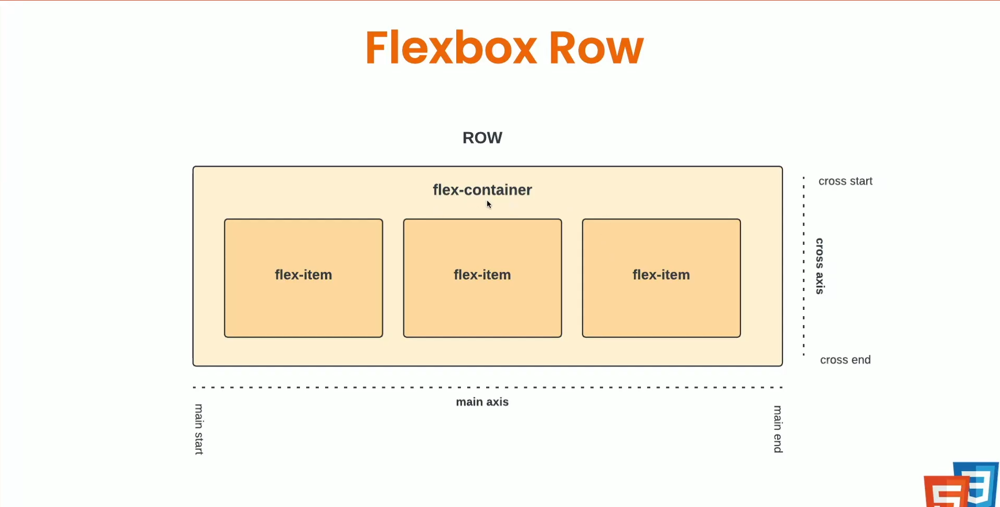
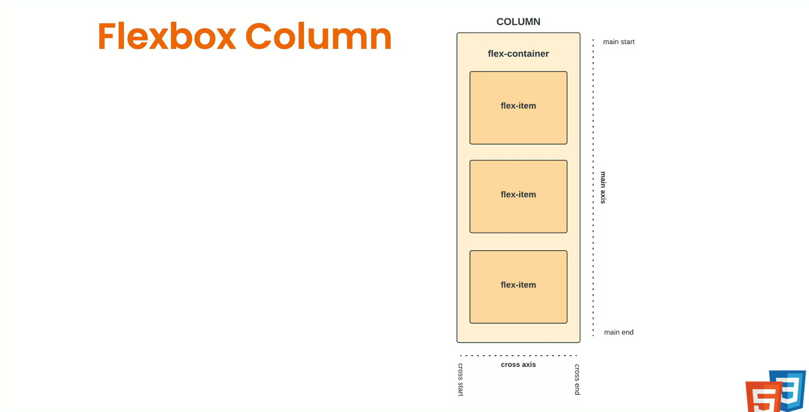
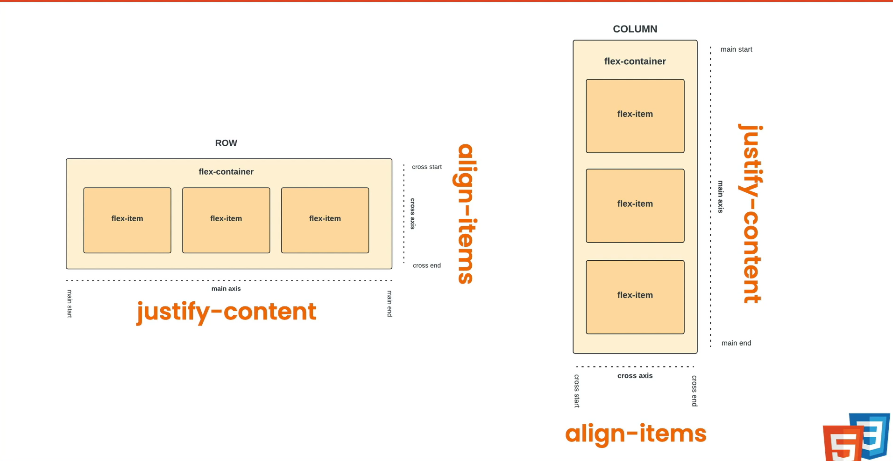

# FlexBox

- [FlexBox](#flexbox)
  - [Section Intro](#section-intro)
  - [What is Flexbox?](#what-is-flexbox)
  - [Flexbox Basics - Containers \& Items](#flexbox-basics---containers--items)
  - [Align \& Justify Items](#align--justify-items)
  - [Flex Properties \& Dyanmic Sizing](#flex-properties--dyanmic-sizing)
  - [Flex Order](#flex-order)

## Section Intro

- What is Flexbox?
- Flex Containers & Items
- Flex wrap & Gap
- Align & Justify Items
- Flex Properties & Sizing
- Flexbox Order
- Mini-Projects

## What is Flexbox?

**Flexbox** is a layout model in CSS that provides an efficient way to arrange, align and distribute elements.

- Great for dealing with dynamic or unknown sizes
- One-dimensional layout model
- **Flex Items** are put in a **flex container**



when flex is row

- main axis is horizonatal
- corss axis is vertical

and vice-versa



this property can be set using `flex-direction`

## Flexbox Basics - Containers & Items

```css
.flex-container {
  background: #ccc;
  display: flex;
  flex-direction: row; /* row , row-reverse, column, column-reverse*/
  gap: 10px; /* both row and column gap short hand */
  flex-wrap: wrap; /* wrap-reverse*/
  row-gap: 10px;
  column-gap: 20px;
}

.flex-item {
  height: 200px;
  width: 200px;
  background-color: coral;
  border: 1px solid black;
}
```

## Align & Justify Items



- `justify-content` always aligns with **main-axis**
- `align-items` always aligns with **corss-axis**

[Flexbox examples](https://css-tricks.com/snippets/css/a-guide-to-flexbox/)

```css
.flex-container {
  display: flex;
  background-color: lightblue;
  height: 500px;
  flex-direction: column;
  justify-content: space-evenly; /* flex-start , flex-end,center, space-evenly, space-around, space-between */
  align-items: center; /* flex-start, flex-end, center, baseline, stretch,*/
}

.flex-item {
  height: 100px;
  width: 100px;
  background-color: coral;
  border: 1px solid black;
}

.item-2 {
  align-self: flex-end;
}
```

## Flex Properties & Dyanmic Sizing

- items shrink even if width is provided. to avoid it set `felx-shrink` parameter as `0`.
- `flex-groow` will grow based on positive value.
  - `1` will take rest of the space
  - `2` will grow 2x faster than others.
- `flex-basis` is altrnate to `width` paremeter.

```css
.flex-item {
  background: coral;
  border: 1px solid black;
  padding: 20px;
  width: 200px;
  flex: 1 0 0;
  /* flex : flex-grow flex-shrink flex-basis */
}

.item-1 {
  flex-shrink: 0; /* 1- default 0-keeps original size, 2 - shrink -twice the others*/
}

.item-2 {
  flex-grow: 1;
}
.item-3 {
  flex-basis: 200px;
}
```

## Flex Order

- we order which item in flex box

```css
.item-1 {
  order: 2;
}
```
